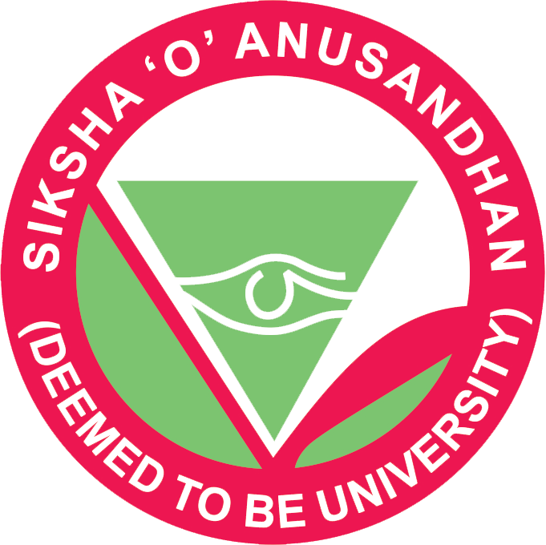
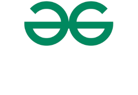
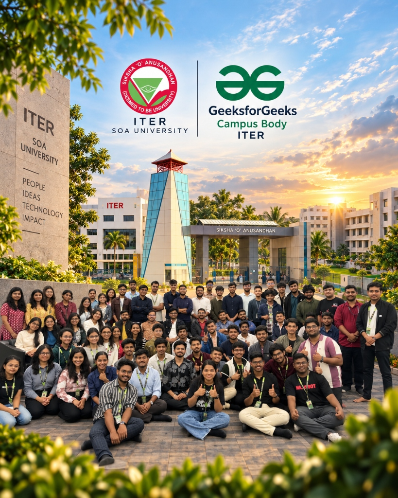

<div align="center">

  <!-- BRAND LOGOS HEADER -->
  <p align="center">
    <a href="https://www.soa.ac.in/iter" target="_blank" rel="noopener noreferrer">
      
    </a>
    &nbsp;&nbsp;&nbsp;&nbsp;&nbsp;&nbsp;&nbsp;&nbsp;
    <a href="https://www.geeksforgeeks.org/" target="_blank" rel="noopener noreferrer">
      
    </a>
  </p>

  # ⚡ GeeksforGeeks (GFG) Campus Body @ ITER
  ### Official Student Chapter · Department of Computer Science & Engineering
  **Siksha 'O' Anusandhan (Deemed to be University), Bhubaneswar, Odisha, India**

  <p align="center">
    <em>"LEARN. BUILD. SHARE." — Empowering the next generation of engineers through research curiosity, open-source innovation, hands-on workshops, and industry mentorship.</em>
  </p>

  <!-- SHIELDS / BADGES -->
  <p align="center">
    <a href="https://react.dev/"></a>
    <a href="https://tanstack.com/router/latest"></a>
    <a href="https://www.typescriptlang.org/"></a>
    <a href="https://tailwindcss.com/"></a>
    <a href="https://vite.dev/"></a>
    <a href="https://nitro.unjs.io/"></a>
  </p>

  <p align="center">
    
    
    
    
    
  </p>

  <p align="center">
    <a href="#-executive-overview">Overview</a> •
    <a href="#-key-features--modules">Features</a> •
    <a href="#-tech-stack--architecture">Tech Stack</a> •
    <a href="#-project-structure">Architecture</a> •
    <a href="#-getting-started">Quickstart</a> •
    <a href="#-chapter-leadership--coordinators">Leadership</a> •
    <a href="#-connect-with-us">Community</a>
  </p>

  <br />

  

</div>

---

## 🏛️ Executive Overview

**GeeksforGeeks Campus Body ITER** is the official student chapter operating under the **Department of Computer Science and Engineering (CSE)** at **Institute of Technical Education and Research (ITER)**, the faculty of engineering and technology of **Siksha 'O' Anusandhan (Deemed to be University)**, Bhubaneswar, Odisha.

Established in **2025**, the chapter serves as an energetic incubator for aspiring software engineers, competitive programmers, research scholars, and tech leaders. We bridge academia with high-velocity industry engineering through peer mentorship, live sandboxes, hackathons, and technical masterclasses.

```
       ┌─────────────────────────────────────────────────────────────┐
       │             GEEKSFORGEEKS CAMPUS BODY ITER                  │
       │                   LEARN • BUILD • SHARE                     │
       └──────────────────────────────┬──────────────────────────────┘
                                      │
        ┌─────────────────────────────┼─────────────────────────────┐
        ▼                             ▼                             ▼
┌───────────────┐             ┌───────────────┐             ┌───────────────┐
│     LEARN     │             │     BUILD     │             │     SHARE     │
│ Peer-led labs │             │ Real-world    │             │ Mentorship,   │
│ & curriculum  │             │ open-source   │             │ seminars &    │
│ masterclasses │             │ production    │             │ tech round-   │
│ in 10+ tracks │             │ applications  │             │ table charcha │
└───────────────┘             └───────────────┘             └───────────────┘
```

### 📊 Key Chapter Milestones

| Metric | Figure | Description |
| :--- | :--- | :--- |
| **Documented Activities** | **14+** | Flagship launches, summits, hackathons, CTFs & masterclasses |
| **Skills Exchange Tracks** | **8 Specialized Tracks** | Quantum, AI/n8n, Web3, Cloud/Linux, DevOps, Networking, CyberSec, Data Science |
| **Student Participants** | **1,800+** | Active engagement across technical and creative competitions |
| **Core Student Builders** | **100+** | Multi-disciplinary team across engineering, media, content & PR |
| **Faculty Mentorship** | **100% Active** | Continuous academic guidance from senior CSE professors & mentors |

---

## ✨ Key Features & Modules

### 📖 3D Interactive Annual Activity Report Flipbook
- **Realistic Turn-Page Physics**: Built with a custom hardware-accelerated canvas engine, allowing students to flip pages of the official **2025–2026 Chapter Newsletter & Dossier** with natural inertia, shadow curvature, and audio feedback.
- **High-Density Archives**: Includes executive messages from SOA University leadership, event photographic records, attendee statistics, and curriculum breakdowns.
- **Controls & Navigation**: Single/double page view toggle, auto-flip presentation mode, thumbnail navigation scrubber, zoom magnifier, and direct high-resolution PDF download.

```
┌─────────────────────────────────────────────────────────────────────────┐
│  [◄ Prev]              GFG ITER ANNUAL REPORT 2025-2026        [Next ►] │
│  ┌───────────────────────────┐ ┌───────────────────────────┐            │
│  │                           │ │                           │  🔍 Zoom   │
│  │   COMMENDATION NOTES &    │ │    SKILLS EXCHANGE        │  🔊 Audio  │
│  │   FACULTY MESSAGES        │ │    TECHNICAL TRACKS       │  🗂 Grid   │
│  │                           │ │                           │  ⬇️ PDF   │
│  └───────────────────────────┘ └───────────────────────────┘            │
└─────────────────────────────────────────────────────────────────────────┘
```

---

### 🎯 Multi-Track Event & Workshop Management
- **Lifecycle Filtering**: Instantly toggle between **Upcoming**, **Ongoing/Live**, and **Past/Archived** summits and workshops with smooth TanStack Router URL query synchronization (`/events?tab=past&category=All`).
- **Deep Event Dossiers (`/events/$eventId`)**:
  - **GFG Skills Exchange Multi-Track Series**: 8 intensive technical workshops (Blockchain & Web3, Quantum Computing, Computer Networking, Cybersecurity, Linux & Cloud, DevOps, AI Automation with n8n, Data Science).
  - **Code Unbound Summit**: Flagship inaugural launch in the Bansuri Guru Auditorium.
  - **Rachitva**: Creative design sprint and rapid elevator pitch competition.
  - **Zer0ne CTF**: Production-grade Capture The Flag cybersecurity competition powered by GFG ITER's custom platform.
  - **Founders Unplugged**: Entrepreneurial reality fireside with startup founders.
  - **ChaiLinks (Chai Pe Charcha)**: Informal roundtable circles connecting faculty mentors with undergraduate researchers over tea.
- **High-Res Lightbox Modal**: Integrated keyboard-accessible, touch-swipeable modal viewer with instant image zoom and multi-angle galleries.

---

### 👥 Core Team & Domain Leads Directory
- **Departmental Structure**: Complete breakdown across **Faculty Coordinators**, **Executive Board**, **Technical Team**, **PR & Media**, **Graphic Design**, **Event Management**, **Content Strategy**, and **Social Media**.
- **Interactive Profiles**: Real-time search, domain filtering, social links (LinkedIn, GitHub, Portfolio), custom role badges, and high-fidelity avatars.

```
                      ┌───────────────────────────┐
                      │    Faculty Coordinators   │
                      │  Mr. Saurav Kumar (CSE)   │
                      │  Mr. Sujit Bebortta (CSE) │
                      └─────────────┬─────────────┘
                                    │
                      ┌─────────────▼─────────────┐
                      │      Executive Board      │
                      │ Vivek Ranjan Sahoo (Pres) │
                      │ Anubhab / Akansha (Coords)│
                      └─────────────┬─────────────┘
                                    │
        ┌──────────────┬────────────┼────────────┬──────────────┐
        ▼              ▼            ▼            ▼              ▼
┌──────────────┐┌──────────────┐┌────────┐┌──────────────┐┌───────────┐
│  Technical   ││  PR & Media  ││ Graphic││    Event     ││  Content  │
│ Architecture ││ Engagement   ││ Design ││ Coordination ││ & Social  │
└──────────────┘└──────────────┘└────────┘└──────────────┘└───────────┘
```

---

### 🏆 Hall of Fame & Achievement Wall
- Showcases national hackathon victories, Smart India Hackathon (SIH) podium finishes, Google Summer of Code (GSoC) contributions, ICPC regionals, IEEE publications, and corporate internship breakthroughs from our active student builders.

---

### 📡 Live Chapter Broadcast Station
- **Real-Time Newsfeed**: Sticky broadcast station with dynamic live pills, date indicators, categorized badge alerts, and direct action triggers.
- **Marquee Ticker Tape**: Smooth multi-row infinite CSS ticker highlighting chapter domains, tech stacks, and industry partners (NVIDIA, IBM, CISCO, AMD, Infosys, SAP, Tata).

---

### 📬 4-Tier Interactive Communication Channel
- Homepage **"STAY IN THE LOOP"** interface equipped with:
  1. Full Name input validation
  2. Contact Phone verification
  3. Official College / Personal Email verification
  4. Detailed Query / Collaboration Message
- Powered by `sonner` interactive toast dispatches and fallback local persistence.

---

## 💻 Tech Stack & Architecture

<div align="center">

| Domain | Technology / Library | Version | Purpose |
| :--- | :--- | :--- | :--- |
| **Core Framework** | [React 19](https://react.dev/) | `^19.2.0` | Latest Concurrent Mode & React primitives |
| **Meta-Framework** | [TanStack Start](https://tanstack.com/start) | `^1.168.26` | Full-stack SSR, streaming, and hydration framework |
| **Routing Engine** | [TanStack Router](https://tanstack.com/router) | `^1.170.16` | 100% Type-safe, file-based routing system |
| **Language** | [TypeScript](https://www.typescriptlang.org/) | `^5.8.3` | Strict static typing and developer ergonomics |
| **Styling** | [Tailwind CSS v4](https://tailwindcss.com/) | `^4.2.1` | Modern zero-runtime utility CSS engine |
| **UI Primitives** | [Radix UI](https://www.radix-ui.com/) | `Latest` | Unstyled, accessible UI foundation components |
| **Motion & Physics** | [Motion / Framer Motion](https://motion.dev/) | `^12.43.0` | Layout transitions, marquee tickers, scroll reveals |
| **Icons** | [Lucide React](https://lucide.dev/) | `^0.575.0` | High-fidelity vector iconography |
| **Data Fetching** | [TanStack Query v5](https://tanstack.com/query) | `^5.101.1` | Async state management and caching |
| **Forms & Schemas** | [React Hook Form](https://react-hook-form.com/) + [Zod](https://zod.dev/) | `^7.71.2` / `^3.24.2` | Robust client-side validation |
| **Notifications** | [Sonner](https://sonner.emilkowal.ski/) | `^2.0.7` | Glassmorphic toast notifications |
| **QR Code Engine** | [qrcode.react](https://github.com/zpao/qrcode.react) | `^4.2.0` | Instant dynamic community check-in generation |
| **Server Runtime** | [Nitro](https://nitro.unjs.io/) | `^3.0.26` | Ultra-fast cross-platform server preset |
| **Bundler** | [Vite 8](https://vite.dev/) | `^8.0.16` | Next-generation frontend tooling |

</div>

---

## 📁 Project Directory Structure

```plaintext
GFG-CAMPUS-BODY-ITER-OFFICIAL-WEBSITE/
├── public/                               # Static Production Assets
│   ├── events/                           # Event Posters, Banners & Workshop Slides
│   │   ├── skills-exchange-banner.jpg    # Official 16:10 Skills Exchange Banner
│   │   └── ...                           # High-res gallery archives
│   ├── logos/                            # Partner & Sponsor SVG Vectors (Nvidia, IBM, Cisco, etc.)
│   ├── reports/                          # 3D Flipbook Assets & Extracted Newsletters
│   │   └── GFG_NEWSLETTER_new.pdf        # Official 2025-2026 Annual Report Dossier (34MB)
│   ├── team/                             # High-Resolution Team & Faculty Avatars
│   ├── Concised_Light.svg                # GFG Light Horizontal Vector Logo
│   ├── Logo_light1.svg                   # GFG Icon Symbol
│   ├── SOA-PNG.webp                      # Official Siksha 'O' Anusandhan Crest
│   └── robots.txt                        # Search Engine Crawling Instructions
│
├── src/                                  # Source Code
│   ├── components/                       # Reusable Presentation Components
│   │   ├── icons/                        # Custom SVG Brand Icons (Discord, etc.)
│   │   ├── site/                         # Domain-Specific Chapter Widgets
│   │   │   ├── AchievementWall.tsx       # Hackathon & Competition Trophies
│   │   │   ├── AnnualReportsSection.tsx  # Flipbook Preview & Metrics
│   │   │   ├── BroadcastStation.tsx      # Chapter Bulletins & Live Feeds
│   │   │   ├── CanvasBackground.tsx      # Particle Matrix Simulation
│   │   │   ├── ContributorsCarousel.tsx  # Executive & Lead Headshots Carousel
│   │   │   ├── FAQ.tsx                   # Interactive Frequently Asked Questions
│   │   │   ├── Footer.tsx                # Universal Footer with SOA & GFG Badges
│   │   │   ├── ImageLightbox.tsx         # Full-Screen Zoomable Image Modal
│   │   │   ├── NativeFlipBook.tsx        # Custom 3D Annual Report Turn-Page Engine
│   │   │   ├── Navbar.tsx                # Responsive Glassmorphic Navigation Bar
│   │   │   └── Primitives.tsx            # Reveal, SectionHeader, Card Containers
│   │   └── ui/                           # Radix UI + Tailwind Primitives
│   │       ├── button.tsx, dialog.tsx, input.tsx, tabs.tsx, ...
│   │
│   ├── lib/                              # Core Constants & Utilities
│   │   ├── site-data.ts                  # Master Data Store (Events, Team, FAQs, Stats)
│   │   └── utils.ts                      # Tailwind Merge & ClassName Utilities
│   │
│   ├── routes/                           # TanStack Router File-Based Routing System
│   │   ├── __root.tsx                    # Master HTML Document, SEO & Global Providers
│   │   ├── index.tsx                     # Official Chapter Homepage
│   │   ├── about.tsx                     # Mission, Vision, Faculty & Academic Pillars
│   │   ├── events.index.tsx              # Multi-Track Events Directory (/events)
│   │   ├── events.$eventId.tsx           # Deep Event Dossier & Timeline (/events/:id)
│   │   ├── team.tsx                      # Complete Chapter Leadership & Team Directory
│   │   ├── community.tsx                 # Community Hub, Discord Channels & QR Scanner
│   │   ├── hall-of-fame.tsx              # Student Honors & National Podiums
│   │   ├── alumni.tsx                    # Alumni Network & Placement Footprint
│   │   └── sitemap[.]xml.ts              # Dynamic XML Sitemap Generator
│   │
│   ├── app.css                           # Global Tailwind CSS Styles & Custom Animations
│   └── router.tsx                        # TanStack Router Configuration & Hydration
│
├── package.json                          # Dependencies & NPM Execution Scripts
├── tsconfig.json                         # TypeScript Strict Compiler Settings
├── vite.config.ts                        # Vite 8 Build & Plugin Orchestration
└── Dockerfile                            # Production Container Build Instructions
```

---

## 🚀 Getting Started & Local Development

### Prerequisites
Make sure you have the following installed on your local workstation:
- **Node.js**: `v20.12.0` or higher (LTS recommended)
- **Package Manager**: `npm` (v10+), `pnpm` (v9+), or `bun` (v1.1+)
- **Git**: For version control

### Installation & Setup

1. **Clone the Repository**:
   ```bash
   git clone https://github.com/MyselfDebdatta/GFG-CAMPUS-BODY-ITER-OFFICIAL-WEBSITE.git
   cd GFG-CAMPUS-BODY-ITER-OFFICIAL-WEBSITE
   ```

2. **Install Dependencies**:
   ```bash
   npm install
   ```

3. **Start the Development Server**:
   ```bash
   npm run dev
   ```
   Open [http://localhost:5173](http://localhost:5173) in your browser to explore the live application with instant Fast Refresh (HMR).

### Available NPM Scripts

| Command | Action |
| :--- | :--- |
| `npm run dev` | Launches the local Vite development server with Hot Module Replacement |
| `npm run build` | Compiles full-stack production build with SSR bundle output in `.vercel/output` |
| `npm run preview` | Spins up a local web server to preview the production build artifacts |
| `npm run lint` | Analyzes code quality and rules using ESLint 9 |
| `npm run format` | Enforces consistent formatting across TypeScript and CSS files using Prettier |

---

## 🐳 Docker & Containerization

You can containerize and deploy the application using Docker for isolated, reproducible deployments:

```bash
# 1. Build the production Docker image
docker build --no-cache -t gfg-iter-portal .

# 2. Run the container on port 5173
docker run -d -p 5173:5173 --name gfg-iter-live gfg-iter-portal

# 3. Access the portal in your browser
open http://localhost:5173
```

---

## 🎨 Design System & Visual Identity

The platform utilizes a futuristic **Cyber-Emerald & Deep Onyx Glassmorphism** design system, tailored specifically for technical developer audiences:

<div align="center">

```
  ┌──────────────────┐    ┌──────────────────┐    ┌──────────────────┐
  │   Brand Emerald  │    │    Deep Onyx     │    │ Surface Elevated │
  │     #00FF7F      │    │     #020B06      │    │     #0A140E      │
  │ Accent & Glowing │    │ Base Background  │    │ Card Background  │
  └──────────────────┘    └──────────────────┘    └──────────────────┘
```

</div>

- **Typography**: `Urbanist` (Headings & Hero Brand) + `Inter` / `Geist` (Technical Body Copy)
- **Glass Panel Classes**: Subtly frosted backgrounds with hairline borders (`border-white/10`) and dynamic radial emerald glow halos.
- **Micro-Interactions**: Hover lift transforms, glowing corner brackets, marquee sliders, and animated badge pulses.

---

## 👥 Chapter Leadership & Coordinators

<div align="center">

| Designation | Name | Department / Affiliation |
| :--- | :--- | :--- |
| **Faculty Coordinator** | **Mr. Saurav Kumar** | Assistant Professor, Dept. of CSE, ITER, SOA University |
| **Faculty Coordinator** | **Mr. Sujit Bebortta** | Assistant Professor, Dept. of CSE, ITER, SOA University |
| **Chapter President** | **Vivek Ranjan Sahoo** | Lead Executive, GFG Campus Body ITER |
| **Club Coordinator** | **Anubhab Samantaray** | Operations & Technical Coordination |
| **Club Coordinator** | **Akansha Ajay** | Operations & Community Engagement |

</div>

---

## 🤝 Contributing Guidelines

We welcome contributions, feature requests, and bug reports from student members and open-source enthusiasts!

1. **Fork the Repository** on GitHub.
2. **Create your Feature Branch**:
   ```bash
   git checkout -b feat/your-feature-name
   ```
3. **Commit your Changes**:
   ```bash
   git commit -m "feat(events): add new workshop track timeline"
   ```
4. **Push to the Branch**:
   ```bash
   git push origin feat/your-feature-name
   ```
5. **Open a Pull Request** against the `main` branch with a clear summary of your changes.

---

## 📄 License & Acknowledgments

- **License**: Released under the [MIT License](LICENSE).
- **Institutional Host**: [Department of Computer Science & Engineering](https://www.soa.ac.in/iter), ITER, Siksha 'O' Anusandhan (Deemed to be University), Bhubaneswar.
- **Parent Organization**: [GeeksforGeeks](https://www.geeksforgeeks.org/) Student Chapters Program.

---

## 🌐 Connect With Us

<div align="center">

[](https://www.linkedin.com/company/gfgiter/)
[](https://www.instagram.com/gfg_iter/)
[](https://chat.whatsapp.com/Hr0puwutetlK6dc1MTXXJZ?mode=wwt)
[](https://discord.gg/PQu6RPxZy)
[](mailto:gfgiter@gmail.com)

<br />

📍 **Chapter Headquarters**:  
Department of Computer Science & Engineering,  
Institute of Technical Education and Research (ITER),  
Siksha 'O' Anusandhan (SOA) Deemed to be University,  
Jagamara, Khandagiri, Bhubaneswar, Odisha – 751030

<br />

<sub>Designed & Engineered with ❤️ by the **GFG ITER Tech & Media Team**</sub>

</div>
